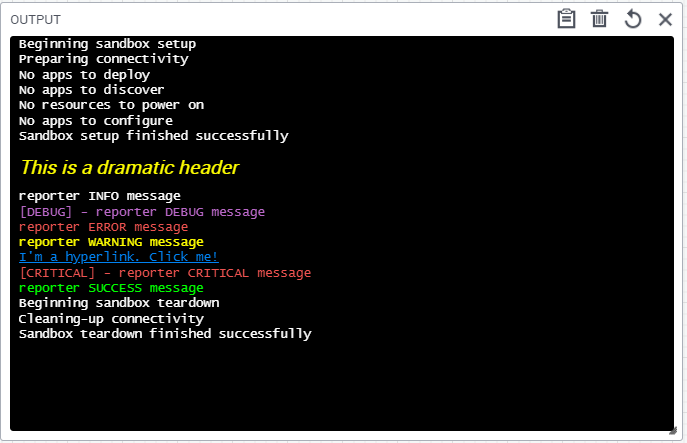

[](https://www.python.org/downloads/release/python/)
[](https://github.com/QualiSystemsLab/cloudshell-sandbox-reporter/actions/workflows/lint-test.yml)

# Cloudshell Sandbox Reporter
This project provides utility classes for formatting and sending html messages to the cloudshell sandbox console.
These methods help to semantically color the text and generate custom html elements (headers / anchors / etc.).

The SandboxReporter class is used to chunk together logging messages with the sandbox console print actions into single commands.
This reduces duplication in your script if you typically log and print the same messages. 
There are granular flags for message instances that you only want to log and not print.

The SandboxReporter is also a "logger adapter" - which means it can be passed into functions in place of the original logger.
You just instantiate the reporter with your logger instance, and log messages will be delegated to the original logger.


### Sample Output
 


### Installation

```
pip install cloudshell-sandbox-reporter
```

### General Usage Samples
```python
import logging
from cloudshell.helpers.sandbox_reporter.reporter import SandboxReporter, SandboxConsole
from cloudshell.api.cloudshell_api import CloudShellAPISession

LIVE_SANDBOX_ID = "16df1ea8-27b3-491d-89b9-10d1076f99c5"
logger = logging.Logger("test logger")
api = CloudShellAPISession("localhost", "admin", "admin", "Global")

reporter = SandboxReporter(api, LIVE_SANDBOX_ID, logger)

reporter.warning_header("Add a yellow, italic header to get attention")

reporter.info("standard INFO level message to logs and console")
reporter.debug("DEBUG message to logs and purple text to console ")
reporter.error("ERROR log and red text to console")
reporter.warning("WARNING log and yellow text to console")
reporter.success("INFO log and green text to console")

# generate a clickable anchor tag in console
reporter.console.anchor_tag_print(url="https://www.google.com", text="click to to go to google!")

# pass reporter into functions expecting logger
def some_func(logger: logging.Logger):
    logger.info("running func")
    
some_func(reporter)

# if you want to avoid noise in the console, just pass along internal logger
some_func(reporter.logger)

# if you only care about console without logging, instantiate console independently
console = SandboxConsole(api, LIVE_SANDBOX_ID)
console.sb_print("write to sandbox console only")

```
- NOTE: In orchestration scripts the SandboxReporter init dependencies are generally provided (api, sandbox id, logger)
  - (examples in next section)

### Orchestration Sample
In cloudshell Orchestration scripts, the sandbox object will provide the sandbox id, api session and logger. 

```python
from cloudshell.workflow.orchestration.setup.default_setup_orchestrator import DefaultSetupWorkflow
from cloudshell.workflow.orchestration.sandbox import Sandbox
from cloudshell.helpers.sandbox_reporter.reporter import SandboxReporter


def custom_config_function(sandbox, components=None):
    """
    Functions passed into orchestration flow MUST have (sandbox, components) signature
    :param Sandbox sandbox:
    :param components
    :return:
    """
    sb_id = sandbox.id
    api = sandbox.automation_api
    logger = sandbox.logger
    
    # instantiate reporter
    reporter = SandboxReporter(api, sb_id, logger)
    reporter.info("starting custom config function!!!")
    
    # some more business logic .........

sandbox = Sandbox()

DefaultSetupWorkflow().register(sandbox, enable_configuration=False)
sandbox.workflow.add_to_configuration(custom_config_function, None)
sandbox.execute_setup()
```

### Shell Command Sample
In shell methods, the `ResourceCommandContext` object will help produce the api, sandbox id, and logger that are passed to SandboxReporter

```python
from cloudshell.shell.core.resource_driver_interface import ResourceDriverInterface
from cloudshell.shell.core.driver_context import InitCommandContext, ResourceCommandContext
from cloudshell.shell.core.session.cloudshell_session import CloudShellSessionContext
from cloudshell.shell.core.session.logging_session import LoggingSessionContext
from cloudshell.helpers.sandbox_reporter.reporter import SandboxReporter
import time


class ReporterTesterDriver (ResourceDriverInterface):

    def __init__(self):
        pass

    def initialize(self, context):
        pass

    def cleanup(self):
        pass
    
    def _some_business_logic(self):
        time.sleep(10)
        
    def cool_service_command(self, context):
        """
        :param ResourceCommandContext context:
        """
        api = CloudShellSessionContext(context).get_api()
        sandbox_id = context.reservation.reservation_id
        with LoggingSessionContext(context) as logger:
            reporter = SandboxReporter(api, sandbox_id, logger)
            reporter.info("Starting Service Command, this may take a while...")
            
            try:
                # simulate long running  action
                self._some_business_logic()
            except Exception as e:
                # logs error and sends red text message to sandbox
                err_msg = f"Error caught during command. {type(e).__name__}: {str(e)}"
                reporter.error(err_msg)
                raise Exception(err_msg)

        return "Service Flow SUCCESSFUL"
```

### License
Free Software: MIT License